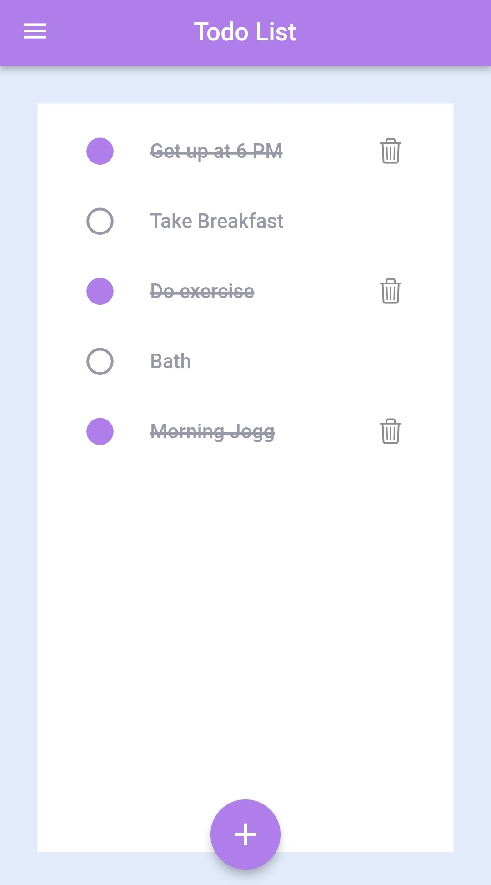
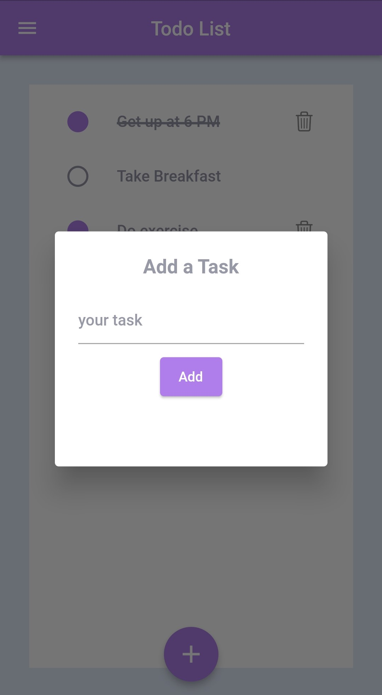
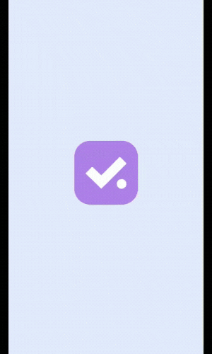

# to_do_list

A to do list app written in Dart using flutter framework

### Screenshots

    
    

### To Do

- Show details of a task on tap with delete option (ShowDialog)
- Grouping of Task
- User Aouth
- Database or firebase integration